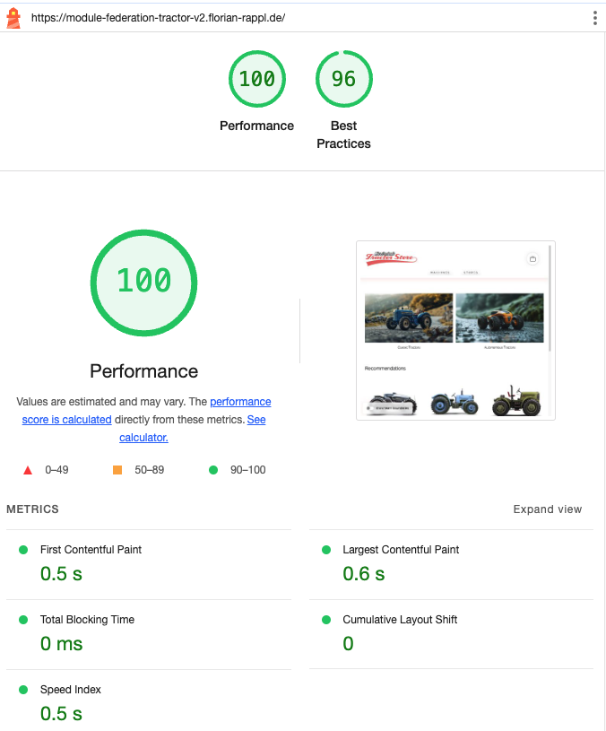

# Module Federation Demo &middot; [](https://github.com/FlorianRappl/module-federation-tractor-v2/blob/main/LICENSE) [](https://discord.gg/kKJ2FZmK8t)

> The Tractor v2 Micro Frontends Sample using Module Federation with different bundlers

:zap: Combine multiple micro frontends built with different technologies - but all using Module Federation.

Feel free to play around with the code using StackBlitz.

[](https://stackblitz.com/github/florianrappl/module-federation-tractor-v2)

A micro frontends sample implementation of [The Tractor Store](https://micro-frontends.org/tractor-store/) built with Module Federation and React. It's based on the [Blueprint](https://github.com/neuland/tractor-store-blueprint).

**Live Demo:** [module-federation-tractor-v2.florian-rappl.de](https://module-federation-tractor-v2.florian-rappl.de/)

## About This Implementation

### Technologies

List of techniques used in this implementation.

| Aspect                     | Solution                                  |
| -------------------------- | ----------------------------------------- |
| 🛠️ Frameworks, Libraries   | [React], [ModuleFederation]              |
| 📝 Rendering               | SPA                                      |
| 🐚 Application Shell       | [rspack]                                  |
| 🧩 Client-Side Integration | Custom                                    |
| 🧩 Server-Side Integration | None                                      |
| 📣 Communication           | Custom Events, Slots                      |
| 🗺️ Navigation              | SPA, One MF per Team, history API routing |
| 🎨 Styling                 | Self-Contained CSS (No Global Styles)     |
| 🍱 Design System           | None                                      |
| 🔮 Discovery               | None                                      |
| 🚚 Deployment              | Static Page                               |
| 👩‍💻 Local Development       | [rspack]                                  |

[React]: https://react.dev/
[ModuleFederation]: https://www.module-federation.io/
[rspack]: https://rspack.dev/

### Limitations

This implementation is deliberately kept simple to focus on the micro frontends aspects. URLs are hardcoded, components could be more DRY and no linting, testing or type-safety is implemented. In a real-world scenario, these aspects should be addressed properly.

### Performance

Several performance optimizations could still be applied, however, in the out-of-the-box state with three micro frontends and multiple components / pages included we'll end up with a lighthouse score of 100/100, which is great.



As a comparison a most lightweight SSR-only solution using the same codebase would be around 99/100. Another SPA sample that uses [Picard.js](https://picard.js.org/) with Native Federation ended up at 88/100. Hence, Piral gives optimal performance - no effort needed.

## How to run locally

### Installation

Clone this repository. Then run the following command inside the repository:

```sh
./setup.sh
```

### Running the Code

Now you can run all micro frontends:

```sh
./run.sh
```

Open http://localhost:1234 in your browser to see the integrated application.

## About The Authors

[smapiot](https://smapiot.com/) is a growing company specialized in delivering IT solutions and services for the emerging space of digital transformation and IoT. smapiot was founded in 2014 and is located in Munich. We are the core maintainers of the [Piral](https://www.piral.io) framework and the [Picard.js](https://picard.js.org) library.

## License

Piral and this sample code is released using the MIT license. For more information see the [license file](./LICENSE).
